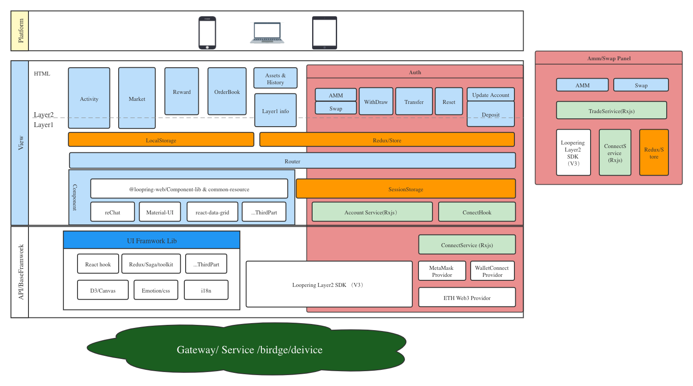

<p align="center">
  <a href="https://github.com/Loopring/loopring-web-v2" rel="noopener" target="_blank"></a>
</p>


<h1 align="center">Loopring Exchange</h1>
<div align="center">

A layer2 walllet in ETH 

[](https://github.com/Loopring/loopring-web-v2/master/LICENSE)

[](https://www.npmjs.com/package/react-data-grid)
 
<!-- [](https://www.npmjs.com/package/react-data-grid) -->

</div>

## Install & Run 

```sh
// with yarn
yarn install
yarn up
cd ./packages/webapp
npm run dev
```

##Framwork Design


